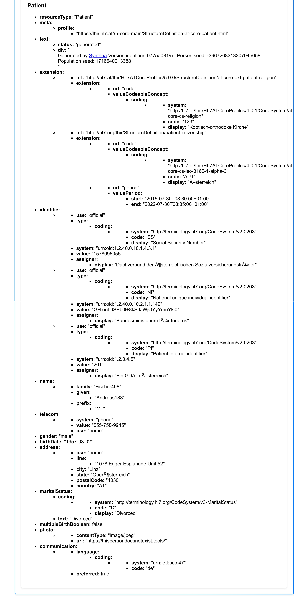

# AT-coreprofile-mapping

This document outlines the configuration for `AT-coreprofile-mapping` used within the Flexporter framework. The configuration focuses on applying specific transformations to FHIR resources in alignment with the HL7 FHIR Austrian core implementation of the Patient profile.

## Introduction

The Synthea Flexible Exporter a.k.a. "Flexporter" is a utility designed to make it easy to add new fields, values, and resource types to Synthea-generated FHIR, without having to modify the Synthea engine. Primary users of this feature are expected to be Implementation Guide authors and users, electronic clinical quality measure developers and testers, and anyone who needs just a slight tweak to the data exported by Synthea.


Flexporter utilizes GraalVM, a high-performance virtual machine, to interpret its mapping file and associated actions as a set of instructions for manipulating Synthea-generated FHIR bundles. GraalVM enables the execution of code written in different languages within the same runtime environment, ensuring seamless integration and interoperability. This setup amplifies the performance and versatility of Flexporter, allowing for efficient and flexible customization of FHIR data to meet diverse use cases and requirements.

## Approach
The basic idea of the Flexporter is that users will define a series of transformations to apply to Synthea data. A predefined set of transformations, such as "set field X to value Y" or "create a new resource" is intended to cover the majority of use cases while still remaining easy to use.

## Overview

The `AT-coreprofile-mapping` configuration ensures that Patient resources conform to the Austrian Core Implementation Guide. It includes actions to retain specific resources, create new Patient resources with detailed field mappings, and apply custom scripts for various transformations.

## Need for an Austrian Patient Profile in the PICA Project

The PICA project requires an Austrian patient profile instead of the US Core implementation that Synthea is based on. The US Core implementation does not fulfill the specific needs and requirements outlined in the Austrian Patient core implementation guideline. Therefore, it is necessary to change, adapt, or extend the profiles and mappings to align with the Austrian standards and extensions.

The HL7 FHIR Austrian core implementation of the Patient profile is detailed at the following URL: [AT Core Patient Profile](https://fhir.hl7.at/r5-core-main/StructureDefinition-at-core-patient.html). This profile specifies the structure and constraints on the Patient resource for use within the Austrian healthcare context.

Within the context of the PICA project, the patient resource will be modeled according to the definition of the HL7 Austria FHIR Core Implementation Guide to accurately represent an Austrian patient. This implementation guide ensures that the patient resource aligns with the specific requirements and conventions of Austrian healthcare practices.

In the PICA Core Profile, the Patient resource is essential for reconstructing processes, particularly within a patient-centric view. Serving as a foundational element, it provides crucial information about the individual associated with the process. Without the Patient resource, the reconstruction of processes would lack vital context and specificity, thereby impeding the accuracy and effectiveness of the analysis.


## Usage

Generating the population one at a time following the Austrian implementation guideline...
```
./run_synthea -fm MappingFile.yml -ig AT-IG
```

Where -fm references a mapping yml file that applies the extensions following the Austrian Core profile. and -ig references the Austrian Core Implementation Guideline.

The mapping file can be found in `./MappingFile.yml`

## Transforming the US Core Implementation

The Flexporter implements the adoption of the Austrian Patient profile by stripping down the US Core implementation to the base Patient profile. This streamlined base is then used to apply the custom extensions specified in the Austrian implementation profile. These custom extensions include fields such as religion, social security numbers, ...

## Actions
Actions are driven by a key property name on the object. 
Here is a high level description of the actions performerd by the flexporter
### Apply to AT Core Profiles

- **Description:** Ensures that the configuration applies specifically to the Austrian Core Profiles.
- **Profile:** [AT Core Patient Profile](https://fhir.hl7.at/r5-core-main/StructureDefinition-at-core-patient.html)
- **Applicability:** Patient

### KeepResources

- **Description:** Specifies which resources should be retained within the FHIR bundle, ensuring they are available for subsequent operations and can serve as the basis for creating FHIR AuditEvent resources.
- **Resources:**
  - Patient
  - Encounter
  - Condition
  - Procedure
  - Observation
  - DiagnosticReport
  - CarePlan
  - MedicationRequest

### create AT-Patient

- **Description:** Creates a new Patient resource based on an existing Patient resource, mapping and transforming fields as specified.
- **Field Mappings:** Maps various fields from the existing Patient resource to the new Patient resource, including identifiers, name, telecom information, address, communication, preferences, and other demographic details.


### Field Mapping Example
```yaml
- location: Patient.name.family
  value: $getField([Patient.name.family])
- location: Patient.name.given
  value: $getField([Patient.name.given])
  ```
## Used scripts
### applyBoolean

- **Description:** Executes a script to handle boolean fields for the Patient resource, such as multiple birth and deceased status.
- **Script:** Updates multiple birth and deceased fields across all Patient entries in the bundle.

### applyIdentifier

- **Description:** Executes a script to apply identifiers to the Patient resource.
- **Script:** Reads identifiers from a JSON file and assigns them to the Patient resource, generating random values for certain identifiers.

### applyExtensions

- **Description:** Executes a script to apply extensions to the Patient resource, such as religious affiliation and citizenship.
- **Script:** Reads extension data from JSON and CSV files, selecting values based on predefined criteria.

### replaceUSCorePatient

- **Description:** Executes a script to replace US Core Patient resources within the FHIR bundle with Austrian Core Patient resources.

## Conclusion
The AT-coreprofile-mapping configuration provides a comprehensive approach to transforming FHIR Patient resources in accordance with the HL7 FHIR Austrian core implementation. It includes detailed actions and scripts to ensure data integrity and compliance with the Austrian healthcare standards. Adapting the Synthea-generated resources to meet Austrian requirements is crucial for the PICA project, ensuring that all patient data aligns with national guidelines and extensions. Additionally, retaining specific resources is essential for maintaining the necessary context and enabling the creation of FHIR AuditEvent resources based on these retained resources.

## Results
This results in an usable profile for Austrian systems with extensions, 
here is an example of one of the generated results


