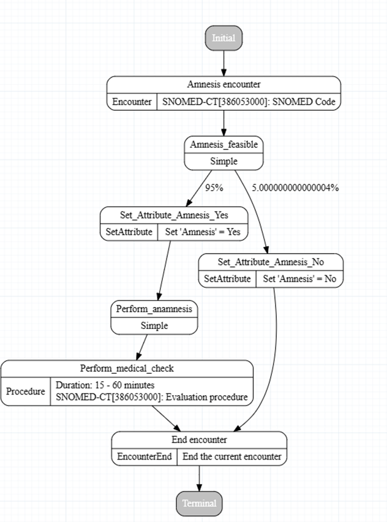

# Generic Modules Framework in Synthea

A Synthea module is essentially a set of rules and parameters that define how a particular disease or treatment progresses over time within a simulated population. Each patient is independently simulated from birth to the present, with their medical history defined by one or more generic modules. These modules encompass various aspects such as diseases, conditions, and medical care, providing a straightforward approach to modelling healthcare scenarios within synthetic populations.

## Table of Contents

- [Overview](#overview)
  - [Attributes and Transitions](#attributes-and-transitions)
  - [Code Systems and ValueSets](#code-systems-and-valuesets)
    - [Code Systems](#codes)
- [Creating Modules](#Creating-Modules)
- [Implementation-of-modules](#Implementation-of-modules)
- [Implementation in PICA Project](#implementation-in-pica-project)
- [Example Module: Anamnesis Sub-Module](#example-module-anamnesis-Sub-Module)
  - [Anamnesis Module Workflow](#anamnesis-module-workflow)
  - [Detailed Example: Anamnesis Module](#detailed-example-anamnesis-module)
- [Additional Modules in PICA](#additional-modules-in-pica)
- [Conclusion](#conclusion)

## Overview

In the context of Synthea, the Generic Modules Framework simplifies the creation and editing of modules for the Synthea Patient Generator. It's a user-friendly tool that follows the Synthea Generic Module Framework, allowing users to make full-featured modules without the complexity of editing JSON files directly. With its visual editor, users can define parameters, set up logic, and create simulations. Modules created via the Module Builder are exportable as JSON files, which can be used with a local Synthea installation.

### Attributes and Transitions

The generics module framework employs attributes and transitions extensively for describing medical entities and controlling the movement between different states, adding a layer of flexibility and adaptability to simulations.

- **Attributes**: Provide modules with the capability to store, reference, and exchange diverse medical entities and strings efficiently. Acting as generic containers, attributes facilitate the allocation of states, strings, and numeric values, simplifying the process of accessing and referencing information throughout the simulation.
- **Transitions**: Control the movement between different states. These transitions come in various forms, such as direct, distributed, conditional, complex, and table-based, each tailored to specific simulation scenarios and needs.

### Code Systems and ValueSets

Where codes are used, a system, code, and display are required fields.

ValueSets can be used optionally. In order for ValueSets to be used, you need to specify a FHIR terminology server using the generate.terminology_service_url property and have a module with a ValueSet specified.

ValueSets can be specified in any State that contains a code. Just add a value_set attribute in addition to the system, code, and display.

#### Codes

##### Snomed
SNOMED Clinical Terms (SNOMED-CT) describe clinical findings, symptoms, diagnoses, procedures, body structures, organisms and other etiologies, substances, pharmaceuticals, devices and specimens. In the Generic Module Framework these codes are used to describe Encounter, Procedure, ConditionOnset, and CarePlanStart states.

##### RxNorm

 RxNorm codes describe prescriptions and medications. They include dosage information and common Brands. In the Generic Module Framework these codes are used only for MedicationOrder states.

##### Loinc

LOINC codes describe tests, measurements, and observations. In the Generic Module Framework these codes are used only for Observation states.

##### DICOM DCM Codes
DICOM-DCM codes describe the modality used to take a series of images in an ImagingStudy. 
##### DICOM SOP Codes
DICOM-SOP codes describe an individual image instance taken in a series of images during an ImagingStudy

## Creating Modules

The [Synthea Module Builder](https://synthetichealth.github.io/module-builder/) simplifies the creation and editing of modules for the Synthea Patient Generator. It's a user-friendly tool that follows the Synthea Generic Module Framework, allowing users to make full-featured modules without the complexity of editing JSON files directly. With its visual editor, users can define parameters, set up logic, and create simulations.
Modules created via the Module Builder are exportable as JSON files. Upon saving, these files can be used with a local Synthea installation.

## Implementation of modules

Modules created using the Synthea Module Builder can be exported as JSON files. These JSON files encapsulate the rules and parameters that define the progression of diseases, treatments, and other healthcare scenarios. To implement these modules in a local installation of Synthea, follow these steps:

1. **Exporting Modules**: Use the Synthea Module Builder to create and edit modules. Once completed, export the modules as JSON files.
2. **Directory Structure**: Place the exported JSON files in the `src/main/resources/modules` directory of your local Synthea installation. Ensure that the directory structure reflects the modular hierarchy, especially for sub-modules.
   - **Main Modules**: Place the main modules directly in the `modules` directory.
   - **Sub-Modules**: Create subdirectories within `modules` for any sub-modules. For example, if a sub-module is required for a specific state in a main module, place it in a dedicated subdirectory.
3. **Referencing Sub-Modules**: In the main module JSON, reference the sub-modules within the relevant states. Ensure that the path to the sub-module is correctly specified to match the directory structure.
   
   Example:
   ```json
   {
     "name": "Example Module",
     "states": {
       "Initial": {
         "type": "Initial"
       },
       "ExampleState": {
         "type": "CallSubmodule",
         "submodule": "subdirectory/submodule_name"
       }
     }
   }

Running Synthea: After placing the modules and sub-modules in the appropriate directories, run Synthea using the standard commands. The new modules will be included in the simulation, allowing for the generation of synthetic patient data based on the specified rules and parameters.

## Implementation in PICA Project

In the PICA project, additional modules need to be created to accommodate the specific requirements and nuances of local healthcare contexts, such as those encountered in Austria. These modules are necessary to ensure that the simulated medical processes accurately reflect the unique treatment protocols, disease progressions, and healthcare practices pertinent to the Austrian healthcare system.

## Example Module: Anamnesis Sub-Module

One of the developed modules in the PICA project is the Anamnesis and medical status sub-module. This module serves as a narrative assessment of past events and circumstances that are or may be relevant to a patient's current health state. Designed as a sub-module for larger modules, it follows a structured format.




### Anamnesis Module Workflow

| State              | Description                                                                 | Transition Type       |
|--------------------|-----------------------------------------------------------------------------|-----------------------|
| Initial            | The starting state of the module                                            | Direct                |
| Encounter          | An encounter state defined by a SNOMED-CT code                              | Direct                |
| Distributed Transition | Progresses based on distributed probabilities informed by medical exceptions | Distributed           |
| Attribute Setting  | Determines if anamnesis is possible, stored in patient's history            | Conditional           |
| Procedure          | Represents the anamnesis procedure with estimated duration and SNOMED-CT code | Direct                |
| Terminal           | Marks the end of the module's assessment process                            | Direct                |

## Detailed Example: Anamnesis Module

1. **Initial State**: The module begins at the "Initial" state.
2. **Encounter State**: The patient enters an encounter, recorded using a SNOMED-CT code.
3. **Distributed Transition**: The module transitions based on predefined probabilities, reflecting potential exceptions or conditions identified during the encounter.
4. **Attribute Setting**: An attribute is set to record whether anamnesis is possible, which is stored in the patient's history for subsequent logical checks.
5. **Procedure State**: The anamnesis procedure is performed, including an estimated duration and the appropriate SNOMED-CT code.
6. **Terminal State**: The module concludes with the "Terminal" state, ending the assessment process.

## Additional Modules in PICA

Within the context of PICA, multiple modules and sub-modules need to be developed to facilitate various processes within the local medical setting. These encompass processes for:

- Surgery
- Gynaecology
- Urology
- Otorhinolaryngology
- Ophthalmology
- Standard clinical procedures

These modules are structured based on written medical guidelines and business process models.

### All modules

[urology standard operating procedures](./img/graphviz/markdown/urology_standard_operating_procedures.md)\
[standkind](./img/graphviz/markdown/standkind.md)\
[sop](./img/graphviz/markdown/sop.md)\
[sop tonsillectomy](./img/graphviz/markdown/sop_tonsillectomy.md)\
[sop for circumcision](./img/graphviz/markdown/sop_for_circumcision.md)\
[sop arthroscopic surgery of the shoulder joint](./img/graphviz/markdown/sop_arthroscopic_surgery_of_the_shoulder_joint.md)\
[sectio](./img/graphviz/markdown/sectio.md)\
[radiology report](./img/graphviz/markdown/radiology_report.md)\
[pr op bqll](./img/graphviz/markdown/pr_op_bqll.md)\
[pph](./img/graphviz/markdown/pph.md)\
[perioperative management total knee arthroplasty ktep](./img/graphviz/markdown/perioperative_management_total_knee_arthroplasty_ktep.md)\
[patient admission](./img/graphviz/markdown/patient_admission.md)\
[outpatient birth](./img/graphviz/markdown/outpatient_birth.md)\
[operation clearance](./img/graphviz/markdown/operation_clearance.md)\
[newborn infection](./img/graphviz/markdown/newborn_infection.md)\
[inpatient admission pregnant woman](./img/graphviz/markdown/inpatient_admission_pregnant_woman.md)\
[individualized laboratory findings](./img/graphviz/markdown/individualized_laboratory_findings.md)\
[hyperbilirubinemia](./img/graphviz/markdown/hyperbilirubinemia.md)\
[htep](./img/graphviz/markdown/htep.md)\
[hernia operation](./img/graphviz/markdown/hernia_operation.md)\
[he lavh tlh gro e op lsk cesa](./img/graphviz/markdown/he__lavh__tlh__gro_e_op_lsk__cesa.md)\
[general anesthesia](./img/graphviz/markdown/general_anesthesia.md)\
[elective gallbladder removal](./img/graphviz/markdown/elective_gallbladder_removal.md)\
[drug allergies](./img/graphviz/markdown/drug_allergies.md)\
[curettage](./img/graphviz/markdown/curettage.md)\
[criteria ambulatory surgery](./img/graphviz/markdown/criteria_ambulatory_surgery.md)\
[conservative therapy](./img/graphviz/markdown/conservative_therapy.md)\
[connatal toxoplasmosis](./img/graphviz/markdown/connatal_toxoplasmosis.md)\
[collect laboratory results](./img/graphviz/markdown/collect_laboratory_results.md)\
[clinical sop htep total endoprosthesis of the hip joint](./img/graphviz/markdown/clinical_sop_htep___total_endoprosthesis_of_the_hip_joint.md)\
[categorisation of surgical procedure](./img/graphviz/markdown/categorisation_of_surgical_procedure.md)\
[cardiac diagnosis](./img/graphviz/markdown/cardiac_diagnosis.md)\
[appendectomy](./img/graphviz/markdown/appendectomy.md)\
[anamnesis medical status](./img/graphviz/markdown/anamnesis_medical_status.md)\
[advanced diagnosis](./img/graphviz/markdown/advanced_diagnosis.md)\

#### Suggestion

It is suggested that all created modules are looked over by a medical proffesional in the suggested field. As stated by the synthea: [Synthea Wiki statement](https://github.com/synthetichealth/synthea/wiki/Contributing)


## Conclusion

The Generic Modules Framework in Synthea, enhanced for the PICA project, provides a robust and flexible approach to simulating healthcare scenarios. By leveraging attributes, transitions, and standardized codes, users can create detailed and realistic synthetic patient data tailored to specific local healthcare contexts.


